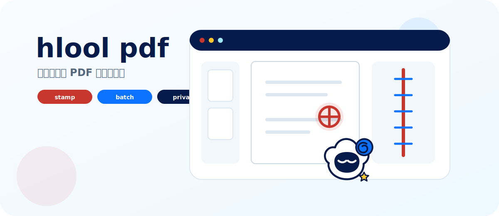
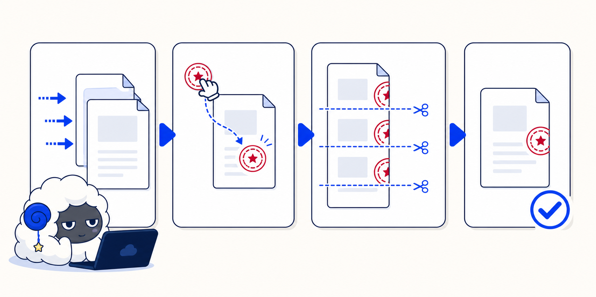

# hlool pdf



**优雅顺手的 PDF 盖章工作台。**

我写 `hlool pdf`，不是想再做一个“上传文件、填一堆坐标、点一下生成”的 PDF 小工具，而是想把日常盖章这件事做成一个真正顺手的工作台：把 PDF 拖进来，把章放到页面上，尺寸、位置、骑缝切片都能直接看见，最后生成一个新的 PDF，原文件不被破坏。

它可以在本地当一个小型桌面工具用，也可以部署成带账号、会话、限流和对象存储后端的在线服务。核心目标很朴素：**让合同、报价单、证明材料这类重复性 PDF 处理少一点折腾，多一点确定性。**

## 目录

- [我为什么做它](#我为什么做它)
- [核心能力](#核心能力)
- [工作流](#工作流)
- [本地运行](#本地运行)
- [开发模式](#开发模式)
- [构建 Windows 可执行文件](#构建-windows-可执行文件)
- [Docker 部署](#docker-部署)
- [配置说明](#配置说明)
- [HTTP API](#http-api)
- [项目结构](#项目结构)
- [安全设计](#安全设计)
- [路线图](#路线图)

## 我为什么做它

很多 PDF 盖章工具本质上还是“表单驱动”的：先填尺寸、页码、边距、旋转角度，再反复预览、修正、生成。对开发者来说这很好实现，但对真正每天处理文件的人来说，它很累。

`hlool pdf` 选择了另一条路：

- **直接操作优先**：章应该被拖到纸上，而不是写进表单里。
- **所见即所得**：普通章、骑缝章、页面整理，画布上看到的效果应该尽量接近最终 PDF。
- **批量是核心能力**：单份文件能用不够，多文件配置、复制配置、生成全部才是办公场景真正省时间的地方。
- **隐私默认靠前**：PDF 不应该长期躺在服务器上。当前设计里，PDF 文件只在浏览器内存和处理请求的临时目录中存在；处理完成后即删除。长期保存的只有账号下的印章库与偏好设置。
- **少打断，多可撤销**：尽量避免原生确认弹窗，让操作发生在工作台里，用撤销、Toast 和明确状态来收口。

一句话概括：**拖进来，盖下去，批量收工。**

## 核心能力

| 能力 | 说明 |
| --- | --- |
| 直接盖章 | 从印章架拖到页面，支持移动、缩放、旋转、透明度、复制、删除、撤销/重做。 |
| 骑缝章 | 支持左、右、上、下四个方向；画布展示真实切片预览；默认 42mm，并提供 40 / 42 / 45mm 常用尺寸。 |
| 随机骑缝切片 | 可用确定性随机分割，让骑缝章切片更接近手工效果；同一随机种子下前端预览与后端输出保持一致。 |
| 多文件工作区 | 可以导入多个 PDF/图片项目；每个文件的盖章配置独立保存，切换文件不会丢配置。 |
| 批量生成 | 可把当前文件配置应用到其他文件，再按队列逐个生成并下载。 |
| 页面整理 / 拼接 | 支持跨 PDF 混排页面、拖拽排序、删页、旋转，并输出新的 PDF 回到工作台。 |
| 图片转 PDF | PNG / JPG / WebP 可以作为页面导入；多张图片可合成一个 PDF 项目。 |
| 印章导入 | 支持 PNG / JPG / WebP；WebP 会在前端转成 PNG；不带透明通道的白底图片会自动做白底透明化，并可撤销。 |
| 输出命名 | 支持 `{原名}-已盖章` 这类模板，中文文件名通过 UTF-8 下载头保留。 |
| 输出加密 | 生成 PDF 时可设置打开密码，后端使用 pdfcpu 处理加密输出。 |
| 账号与印章库 | 默认可临时身份进入；注册后印章、别名、默认尺寸和输出模板会长期保存在账号库里。 |
| 自托管存储 | 印章库和设置可落本地磁盘，也可切到 S3 / R2 / MinIO / B2 等 S3 兼容后端。 |



## 工作流

### 1. 导入文件

打开页面后可以直接拖入 PDF，也可以导入图片。已经有项目时，导入会让你选择“并入当前项目”或“作为新项目打开”。这让两种场景都自然：

- 把一批合同作为多个独立文件处理。
- 把扫描图片或其他 PDF 页面追加到当前文档末尾。

### 2. 放置印章

印章在左侧印章架中管理。把章拖到 PDF 页面上即可放置；选中后可以在画布上直接移动、缩放、旋转，也可以在右侧检查器里精确调整毫米尺寸、角度和透明度。

常用操作都支持快捷键：

| 快捷键 | 行为 |
| --- | --- |
| `Ctrl+Z` | 撤销 |
| `Ctrl+Shift+Z` | 重做 |
| `Delete` | 删除选中印章 |
| `Esc` | 取消选中或退出当前放置状态 |
| `Ctrl+滚轮` | 缩放页面 |

### 3. 做骑缝章

骑缝章不是简单把整张章压成一条红边，而是按页数切成不同的片段。前端预览与后端输出使用同一套切片逻辑，所以你在边缘看到哪一片，最终 PDF 就盖哪一片。

可以调整：

- 骑缝方向：左 / 右 / 上 / 下。
- 覆盖页码：全部或类似 `1,3-5` 的页码表达式。
- 尺寸、边距、位置百分比、透明度。
- 最大切片数与随机种子。

### 4. 批量处理

一份文件配置好了之后，可以把当前配置应用到队列里的其他文件。普通章会按页码对应复制，超出目标文件页数的部分会自动跳过。然后使用“生成全部”，每个已配置文件会依次调用后端生成并下载。


### 5. 页面整理

页面整理适合做这些事：

- 从多个 PDF 中挑页面，合成一份新文件。
- 拖拽调整页序。
- 删除不需要的页面。
- 给单页做 90 度旋转并烘进输出 PDF。

整理完成后，新的 PDF 会回到工作区里继续盖章或导出。


## 本地运行

### 环境要求

- Go `1.26.4+`
- Node.js `22.13+`
- npm `10+`

### 启动

```powershell
cd F:\code\pdf\hlool-pdf

npm --prefix web install
npm --prefix web run build

go run .\cmd\hlool-pdf --addr 127.0.0.1:8088 --open
```

默认地址：

```text
http://127.0.0.1:8088
```

本地数据默认放在用户配置目录下的 `hlool-pdf` 文件夹中。想把数据放到项目目录，方便备份或做便携版，可以这样启动：

```powershell
go run .\cmd\hlool-pdf --addr 127.0.0.1:8088 --data-dir .\.hlool-data-dev --open
```

## 开发模式

开发时建议使用脚本同时启动 Go API 和 Vite：

```powershell
.\scripts\dev.ps1
```

脚本会做几件事：

- 如果 `web/node_modules` 不存在，先执行 `npm --prefix web ci`。
- 启动 Go 后端：`http://127.0.0.1:8088`。
- 启动 Vite 前端：`http://127.0.0.1:5173`。
- 设置 `HLOOL_CORS_ORIGINS=http://127.0.0.1:5173`，避免开发代理下的 CSRF / Origin 检查误拦截。

也可以手动分两个终端运行：

```powershell
go run .\cmd\hlool-pdf --addr 127.0.0.1:8088 --data-dir .\.hlool-data-dev
```

```powershell
npm --prefix web run dev -- --host 127.0.0.1 --port 5173
```

## 构建 Windows 可执行文件

推荐直接使用脚本：

```powershell
.\scripts\build.ps1
```

脚本会安装前端依赖、构建 Web UI、执行 Go 测试，并输出：

```text
dist\hlool-pdf.exe
```

手动构建命令如下：

```powershell
cd F:\code\pdf\hlool-pdf
npm --prefix web ci
npm --prefix web run build

New-Item -ItemType Directory -Path dist -Force
go build -tags embed -trimpath -ldflags "-s -w" -o dist\hlool-pdf.exe .\cmd\hlool-pdf
```

运行：

```powershell
.\dist\hlool-pdf.exe --addr 127.0.0.1:8088 --open
```

便携数据目录：

```powershell
.\dist\hlool-pdf.exe --data-dir .\.hlool-data-portable --open
```

如果依赖下载遇到网络问题，可以临时设置代理：

```powershell
$env:HTTP_PROXY="http://127.0.0.1:9000"
$env:HTTPS_PROXY="http://127.0.0.1:9000"
```

`scripts/build.ps1` 对 `npm ci` 和 `go test ./...` 已经内置了一次代理重试。

## Docker 部署

构建镜像：

```powershell
docker build -t hlool-pdf:local .
```

本地运行：

```powershell
docker run --rm `
  -p 127.0.0.1:8080:8080 `
  -e HLOOL_ALLOWED_HOSTS=127.0.0.1,localhost `
  -v "${PWD}\.hlool-data-docker:/data" `
  hlool-pdf:local
```

访问：

```text
http://127.0.0.1:8080
```

如果 Docker 构建下载依赖失败，可以把宿主机代理传给构建过程：

```powershell
docker build `
  --build-arg HTTP_PROXY=http://host.docker.internal:9000 `
  --build-arg HTTPS_PROXY=http://host.docker.internal:9000 `
  -t hlool-pdf:local .
```

生产部署建议把容器只暴露给反向代理，由 Nginx / Caddy 负责 HTTPS：

```powershell
docker run -d `
  --name hlool-pdf `
  -p 127.0.0.1:8080:8080 `
  -e HLOOL_ALLOWED_HOSTS=pdf.example.com `
  -e HLOOL_BEHIND_PROXY=1 `
  -e HLOOL_ALLOW_GUEST=0 `
  -v hlool-pdf-data:/data `
  hlool-pdf:local
```


## 配置说明

### 常用运行配置

| 变量 | 默认值 | 说明 |
| --- | --- | --- |
| `HLOOL_ADDR` | `127.0.0.1:8088` | HTTP 监听地址；也可用 `--addr` 覆盖。 |
| `HLOOL_DATA_DIR` | 用户配置目录 / `hlool-pdf` | SQLite 用户库、本地印章库和设置目录；也可用 `--data-dir` 覆盖。 |
| `HLOOL_OPEN_BROWSER` | `false` | 启动后自动打开浏览器；也可用 `--open` 覆盖。 |
| `HLOOL_ALLOWED_HOSTS` | 空 | Host 白名单。生产环境建议设置为正式域名，防 DNS rebinding。 |
| `HLOOL_CORS_ORIGINS` | 空 | 允许跨域调用 API 的来源，逗号分隔。正常同源部署可留空。 |
| `HLOOL_BEHIND_PROXY` | `false` | 位于 HTTPS 反代之后时设为 `1`，服务会信任 `X-Forwarded-Proto`。 |
| `HLOOL_TLS_CERT` / `HLOOL_TLS_KEY` | 空 | 同时设置后启用内置 HTTPS。 |
| `HLOOL_SECURE_COOKIES` | 自动 | 会话 Cookie 的 `Secure` 标记。TLS 或反代下自动启用。 |
| `HLOOL_ADMIN_USERNAME` / `HLOOL_ADMIN_PASSWORD` | 空 | 启动时创建或刷新管理员账号，登录后可访问 `/admin`。 |
| `HLOOL_ALLOW_REGISTER` | `true` | 注册总开关的启动默认值；后台保存后以 SQLite 设置为准。 |
| `HLOOL_REQUIRE_INVITE` | `false` | 是否要求邀请码注册的启动默认值；后台保存后以 SQLite 设置为准。 |
| `HLOOL_ALLOW_THIRD_PARTY_REGISTER` | `true` | 第三方身份首次自动开号的启动默认值。 |
| `HLOOL_ALLOW_GUEST` | `true` | 是否允许临时身份。临时身份约 24 小时后连同印章库一起清除。 |
| `HLOOL_MAX_PROCESS_BODY_MB` | `220` | `/api/process`、`/api/compose`、`/api/image-to-pdf` 上传体积上限。 |
| `HLOOL_MAX_STAMP_MB` | `20` | 单个印章图片上传体积上限。 |
| `HLOOL_MAX_CONCURRENT_JOBS` | `GOMAXPROCS` | PDF 重型任务并发数。小内存机器建议调低。 |

### S3 / R2 / MinIO / B2 后端

只要设置 `HLOOL_S3_BUCKET`，印章库和设置就会切到 S3 兼容存储。账号与会话仍保存在本地 SQLite 中。

| 变量 | 说明 |
| --- | --- |
| `HLOOL_S3_BUCKET` | 桶名。设置后启用 S3 后端。 |
| `HLOOL_S3_REGION` | 区域。AWS S3 必填；自定义 endpoint 可省略，默认 `auto`。 |
| `HLOOL_S3_ENDPOINT` | 自定义 endpoint，例如 Cloudflare R2、MinIO、Backblaze B2。 |
| `HLOOL_S3_PREFIX` | 可选 key 前缀，会放在 `users/{uid}/...` 之前。 |
| `HLOOL_S3_FORCE_PATH_STYLE` | MinIO 通常需要设为 `1`。 |
| `HLOOL_S3_SSE` | 服务端加密模式：`none` / `AES256` / `aws:kms`。 |
| `HLOOL_S3_KMS_KEY_ID` | `HLOOL_S3_SSE=aws:kms` 时使用的 KMS key。 |
| `HLOOL_S3_CHECKSUM` | `required` / `supported`。默认 `required`，兼容更多 S3 实现。 |

凭证使用标准 AWS 凭证链，例如：

- `AWS_ACCESS_KEY_ID`
- `AWS_SECRET_ACCESS_KEY`
- `AWS_PROFILE`
- IAM Role

程序不会通过自己的 `HLOOL_*` 环境变量接收密钥。

## HTTP API

当前服务端是无状态 PDF 处理模型：PDF 文件随请求上传，处理完成后直接以 PDF 响应流返回，临时目录随请求结束删除。长期保存的是“用户库”：印章和设置。

### 认证

| 方法 | 路径 | 说明 |
| --- | --- | --- |
| `POST` | `/auth/guest` | 创建或复用临时身份。 |
| `POST` | `/auth/register` | 注册账号；临时身份注册会原地升级，保留印章和设置。 |
| `POST` | `/auth/login` | 登录并写入 `HttpOnly` 会话 Cookie。 |
| `POST` | `/auth/logout` | 注销当前会话。 |
| `GET` | `/auth/me` | 获取当前用户信息。 |

### 用户库

| 方法 | 路径 | 说明 |
| --- | --- | --- |
| `GET` | `/api/stamps` | 列出当前用户的印章。 |
| `POST` | `/api/stamps` | 上传印章图片。后端接受 PNG / JPG；WebP 由前端转码。 |
| `GET` | `/api/stamps/{id}` | 获取印章元数据。 |
| `PATCH` | `/api/stamps/{id}` | 重命名印章。 |
| `DELETE` | `/api/stamps/{id}` | 删除印章。 |
| `GET` | `/api/stamps/{id}/content` | 读取印章图片内容。 |
| `GET` | `/api/settings` | 读取用户设置。 |
| `PUT` | `/api/settings` | 保存用户设置，带版本冲突检测。 |

### PDF 处理

| 方法 | 路径 | 说明 |
| --- | --- | --- |
| `POST` | `/api/process` | 给上传的 PDF 加普通章 / 骑缝章 / 输出加密，并直接返回成品 PDF。 |
| `POST` | `/api/compose` | 从多个上传 PDF 中按页引用重排、拼接、旋转，直接返回新 PDF。 |
| `POST` | `/api/image-to-pdf` | 把单张图片转换为一页 A4 PDF。 |
| `GET` | `/healthz` | 健康检查。 |

`/api/process` 的 `params` 字段示例：

```json
{
  "placements": [
    {
      "stampId": "stamp_...",
      "pageNumber": 1,
      "xPt": 420,
      "yPt": 650,
      "widthPt": 119.1,
      "heightPt": 119.1,
      "rotation": 0,
      "opacity": 1
    }
  ],
  "seamSeals": [
    {
      "stampId": "stamp_...",
      "pages": "全部",
      "side": "right",
      "sizePt": 119.1,
      "positionPercent": 50,
      "marginPt": 0,
      "opacity": 1,
      "maxSlices": 20,
      "randomSeed": 0
    }
  ],
  "outputPassword": "",
  "outputName": "合同-已盖章.pdf"
}
```

密码 PDF 可在 multipart 表单里额外传 `password` 字段；缺密码或密码错误时会返回 `code: "password_required"`。

## 项目结构

```text
hlool-pdf/
  cmd/hlool-pdf/          程序入口、配置装配、浏览器自动打开
  internal/auth/          账号、会话、Argon2id 密码哈希、限流、游客身份
  internal/config/        环境变量解析与运行配置
  internal/library/       用户库抽象：本地磁盘 / S3 兼容存储
  internal/pdf/           pdfcpu 封装：盖章、骑缝、拼接、旋转、图片转 PDF
  internal/server/        HTTP API、静态 Web UI、CSRF/CORS/安全头
  internal/webui/         嵌入式前端产物
  web/                    React 19 + TypeScript + Vite 前端
  web/src/app/            应用骨架、顶栏、错误边界、全局快捷键
  web/src/features/       盖章、骑缝、缩略图、页面整理、认证、导入等功能
  web/src/state/          zustand 状态、撤销重做、Toast
  web/src/ui/             按钮、菜单、弹窗、滑块等基础组件
  assets/brand-alan-pdf/  README 与品牌素材
  scripts/                开发与构建脚本
```

技术栈：

- 后端：Go、`pdfcpu`、纯 Go SQLite (`modernc.org/sqlite`)、AWS SDK v2。
- 前端：React 19、TypeScript、Vite、Tailwind CSS v4、Radix、zustand、zundo、PDF.js、lucide-react。
- 构建：Go embed 将前端产物打进单个可执行文件。

## 安全设计

`hlool pdf` 的安全策略围绕一个原则：**用户的 PDF 不做长期存储，账号库只保存必要的印章与偏好。**

已实现的边界包括：

- **阅后即焚处理**：`/api/process`、`/api/compose`、`/api/image-to-pdf` 都使用请求级临时目录，响应完成后删除；后台还有兜底清扫。
- **会话 Cookie**：登录后使用 `HttpOnly + SameSite=Strict` Cookie；TLS 或反代环境下启用 `Secure`。
- **密码哈希**：账号密码使用 Argon2id PHC 格式存储。
- **登录与注册限流**：按 IP / 用户名维度限制暴力尝试。
- **游客身份自动清理**：临时身份约 24 小时后清除账号、会话和用户库。
- **用户隔离**：所有印章和设置路径都由服务端按 uid 派生，客户端不能指定任意路径。
- **CSRF / Origin 检查**：状态修改请求会校验同源或 `HLOOL_CORS_ORIGINS` 白名单。
- **Host 白名单**：生产可通过 `HLOOL_ALLOWED_HOSTS` 限制 Host，防 DNS rebinding。
- **安全响应头**：CSP、`X-Frame-Options: DENY`、`X-Content-Type-Options`、`Referrer-Policy`，HTTPS/反代下开启 HSTS。
- **错误脱敏**：内部错误只写服务端日志，响应不暴露本地路径或对象存储 key。
- **任务并发限制**：PDF 重型任务有全局并发上限，避免大文件并发压垮服务。

生产部署时我建议：

1. 使用 HTTPS，并把服务放在反向代理后。
2. 设置 `HLOOL_ALLOWED_HOSTS`。
3. 外网实例视情况关闭游客模式：`HLOOL_ALLOW_GUEST=0`。
4. 给反向代理设置上传大小限制。
5. 给容器设置 CPU、内存、磁盘配额。
6. 若使用 S3，桶必须关闭公开访问，并只允许 TLS 访问。

## 路线图

我会优先继续打磨这些方向：

- **方案预设**：保存“合同章”“报价章”等常用组合，一键套用。
- **批量 ZIP 下载**：生成全部后打包下载，减少浏览器多文件下载提示。
- **更完整的桌面体验**：输出目录、文件夹批处理、便携配置。
- **数字证书签名**：PFX / P12 签名能力，与传统 PDF 签章流程衔接。
- **更多异常 PDF 兼容**：继续强化旋转页、CropBox、加密 PDF 和奇异页面尺寸的处理。

## 许可证

当前仓库暂未声明许可证。公开分发或商用前，请先补充明确的 `LICENSE` 文件。
