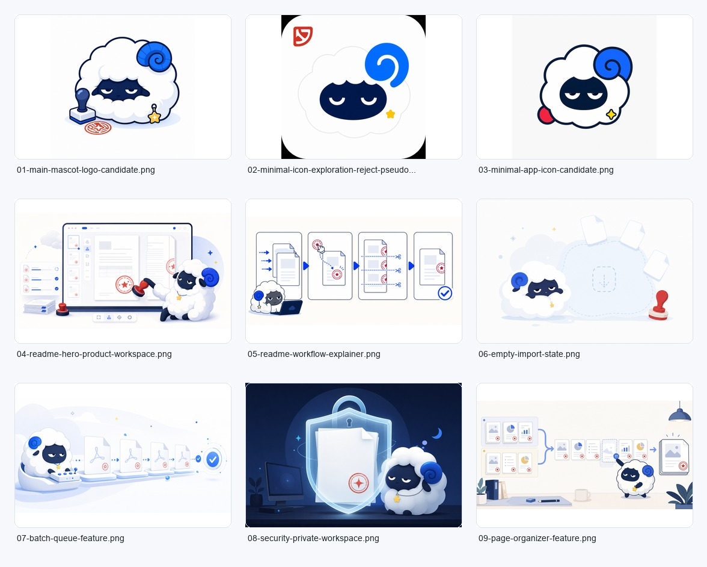
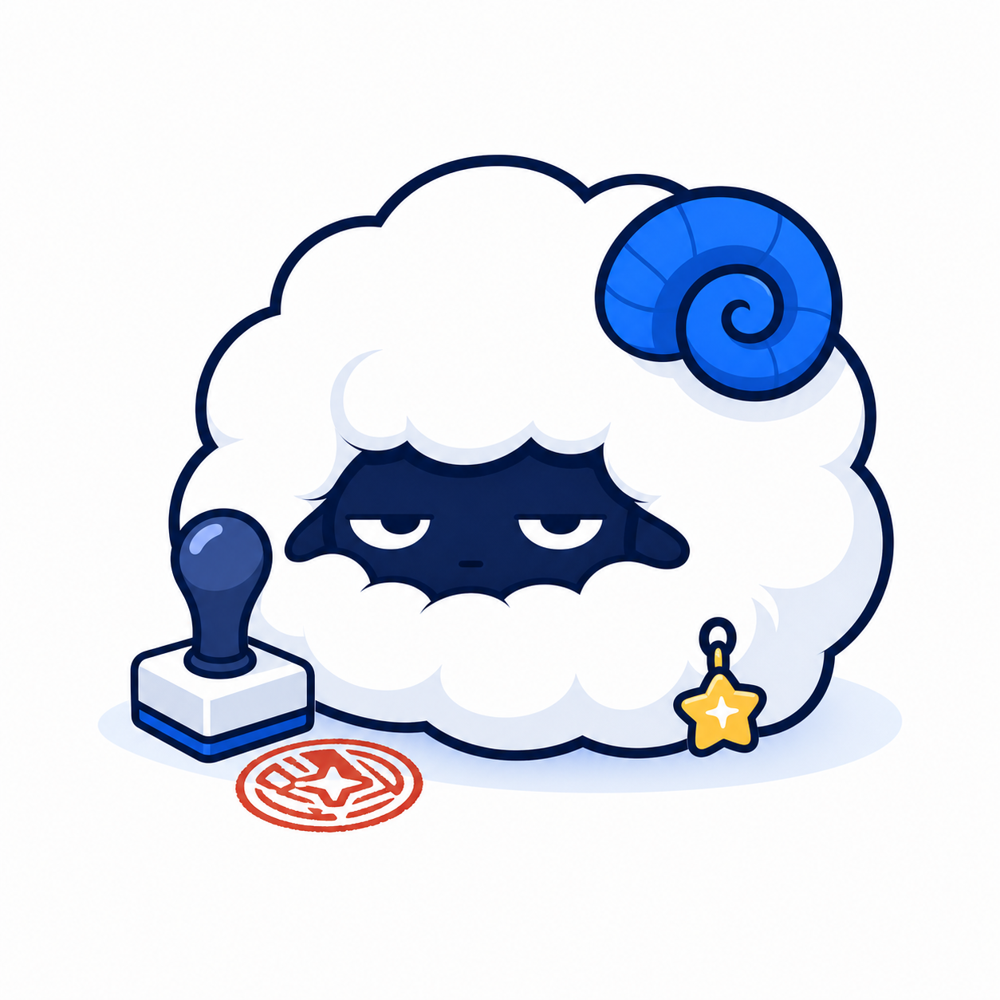
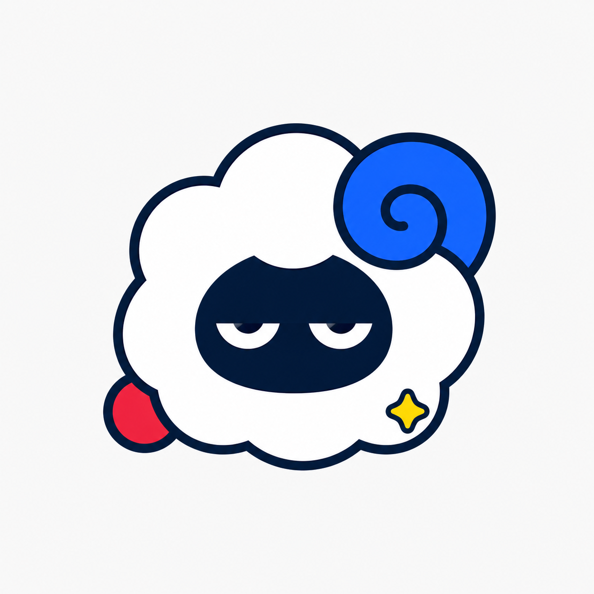
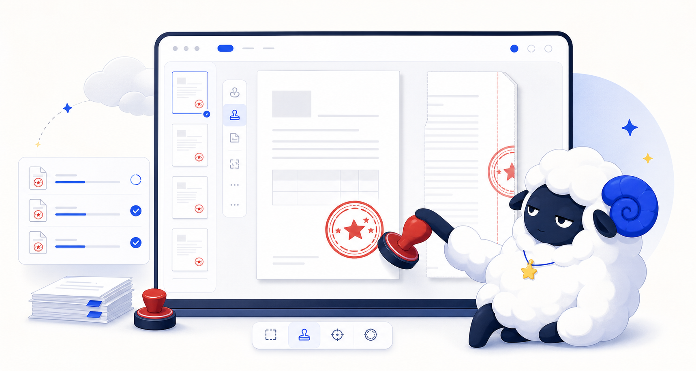

# Brand Asset Index

## Recommended Set

| Role | Primary file | Backup / exploration |
|---|---|---|
| Main mascot logo | `svg/logo-mark.svg` | `generated/01-main-mascot-logo-candidate.png` |
| App icon | `svg/app-icon.svg` | `generated/03-minimal-app-icon-candidate.png` |
| Favicon | `svg/favicon-alan.svg` | current `web/public/favicon.svg` as legacy |
| Horizontal logo | `svg/logo-lockup-horizontal.svg` | none |
| README banner | `svg/readme-banner.svg` | `generated/04-readme-hero-product-workspace.png` |
| Workflow explainer | `generated/05-readme-workflow-explainer.png` | future SVG redraw |
| Feature icon set | `svg/feature-icons.svg` | none |
| Empty state | `generated/06-empty-import-state.png` | future SVG redraw |
| Batch feature | `generated/07-batch-queue-feature.png` | future SVG redraw |
| Page organizer | `generated/09-page-organizer-feature.png` | future SVG redraw |

## Contact Sheet

## Generated Images

## Rejected / Do Not Use

`generated/02-minimal-icon-exploration-reject-pseudotext.png`

Reason: the red mark in the corner reads like accidental pseudo-text. This is useful as a reminder that generated icon drafts should be redrawn as SVG before production use.
